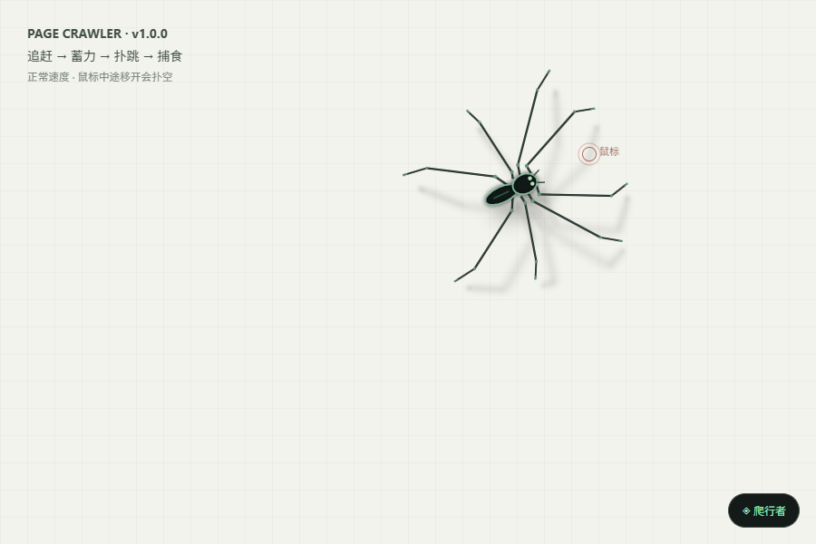

# Page Crawler · 网页蜘蛛动作试验场

独立的 JavaScript / CSS / Canvas 项目，可作为本地演示，也可将同一份核心代码安装成油猴脚本。当前版本 **1.0.0**：连续三维弓形腿、鼠标追随、快速扑跳捕食、随页面滚动与可恢复的网页接触效果。



## 运行演示

只运行演示需要 Node.js 20 或更新版本，**不必安装 npm 依赖**：

```sh
node scripts/serve.cjs
```

打开 **http://127.0.0.1:8825/**。也可直接双击 `index.html`，但推荐本地服务器以便查看图册、播放视频和下载脚本。

安装开发依赖后同样可以：

```sh
npm ci
npm run dev
```

换端口（PowerShell）：

```powershell
$env:PORT = '8830'
npm run dev
```

服务只绑定本机地址。退出终端中的服务使用 Ctrl+C。浏览器页面无需外部库、网络请求或构建步骤。

## 已有功能

| 功能 | 行为 |
| --- | --- |
| 八条四段长腿 | 固定三维骨长，整条腿共同弯曲，透视产生不同的屏幕长度 |
| 独立迈步 | 支撑脚保持地面坐标，摆动脚交错前移；支撑多边形限制抬脚与前进 |
| 鼠标追随 | 朝光标行走、预测转向，空白区域也可通过；到达后停止踱步 |
| 扑跳捕食 | 约 125 像素内收稳、蓄力、快速腾空，落地后前腿抓握与口器开合 |
| 扑空与重捕 | 起跳时锁定目标，鼠标逃开会扑空，恢复后继续追赶 |
| 冷却与抖动过滤 | 起跳后冷却 2.2 秒；光标离上次目标超过 65 像素才重新武装 |
| 页面接触效果 | 踩到可处理的文字或容器时产生形变、轮廓和碎片，支持自动回弹与手动恢复 |
| 页面滚动 | 身体、脚与运动轨迹随实际滚动位移移动；暂停和腾空期间也保持坐标关系 |
| 控制面板 | 速度、力度、跟随、捕食、霓虹、暂停、恢复、关闭与收起 |
| 油猴配置 | 安装到其他网站后保存设置，提供按主机排除功能 |

常速固定 60 Hz 回放中，一次约 107 像素扑击腾空 **0.133 秒**、空中速度约 **820 像素/秒**。这些是项目动画实测参数，不是蜘蛛生物学测量值。所有功能在同一份 `page-crawler.user.js` 中；没有另一份需要同步的演示版脚本。

快捷键：**Alt+Shift+C** 开关、**Alt+Shift+R** 恢复、**Alt+Shift+P** 暂停。输入框和可编辑内容中不触发快捷键。关闭“接近鼠标时扑跳捕食”可单独观察行走；关闭“跟随鼠标”改为自主漫步。

## 安装油猴脚本

1. 安装并启用 [Tampermonkey](https://www.tampermonkey.net/)。
2. 新建脚本，粘贴 [page-crawler.user.js](page-crawler.user.js) 的全部内容并保存。
3. 打开或刷新普通 HTTP/HTTPS 网页，在右下角使用控制面板。

浏览器内部页、禁止用户脚本的页面不适用；跨域 iframe、关闭的 Shadow DOM 和 Canvas 内部文字不产生接触形变。脚本不派发鼠标点击；输入、按钮、链接仍可正常使用。当前交付包含油猴脚本，独立浏览器扩展仍未实现。权限和脚本元数据见 [Tampermonkey 官方文档](https://www.tampermonkey.net/documentation.php)。

## 学习文档

建议按“运行 → 原理 → 参数 → 验证”的顺序阅读：

| 文档 | 内容 |
| --- | --- |
| [学习路线与代码导读](docs/learning.md) | 时间步、坐标、腿链闭合、步态、转向、扑跳、滚动和恢复；附练习 |
| [代码架构](docs/architecture.md) | 核心函数、数据流、状态和扩展位置 |
| [参数说明](docs/parameters.md) | 当前参数值、单位、相互约束和修改入口 |
| [论文与参考资料](docs/research.md) | 论文链接、采用的依据、未采用的推论与官方技术文档 |
| [测试与录制](docs/testing.md) | 七组测试、浏览器选择、结果位置、图片和 MP4 的再生成 |
| [照片与视频](docs/gallery.md) | 演示照片、捕食视频、行走视频与素材来源 |
| [版本记录](docs/changelog.md) | 首个版本的功能与交付内容 |

浏览器图册入口：[gallery.html](gallery.html)。论文参考图及作者署名保存在 `assets/reference/`，不会在演示运行时加载外网。

## 项目目录

```text
page-crawler/
├── index.html                 演示试验场
├── gallery.html               照片与视频图册
├── page-crawler.user.js        核心代码，也是油猴安装文件
├── package.json / package-lock.json
├── docs/                      学习、原理、参数、研究、验证和图册文档
├── scripts/                   本地服务、检查总入口、录制和打包工具
├── tests/                     七组实际浏览器检查与浏览器配置
├── assets/images/             演示照片
├── assets/videos/             正常速度演示 MP4
├── assets/reference/          论文图与署名信息
├── artifacts/validation/      本地生成的回归结果、截图和校验摘要（不提交）
└── dist/                      npm run package 生成的可移植压缩包
```

## 开发与检查

```sh
npm ci
npm test
npm run test:hunt
npm run test:legs
npm run package
```

Windows 默认使用已安装的 Edge。使用 Playwright 自带 Chromium：

```powershell
npm run browser:install
$env:CRAWLER_BROWSER_CHANNEL = 'bundled'
npm test
```

macOS / Linux 默认使用已安装的 Playwright Chromium；先运行 `npm run browser:install`。运行检查后，源码指纹与结果生成在 `artifacts/validation/summary.json`，这些运行产物不提交到 Git。录制和媒体更新另见 [测试与录制](docs/testing.md)。
