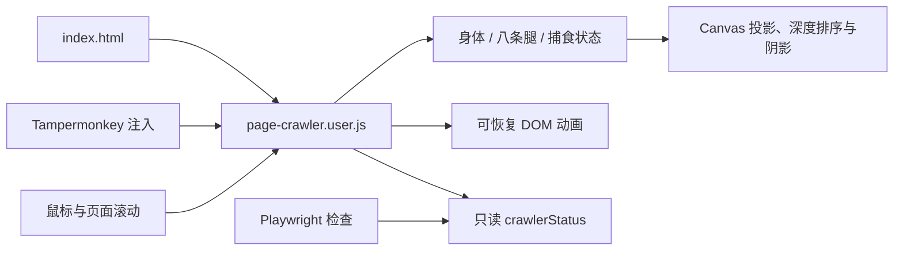

# 架构与数据流

这是一个便于直接安装的单文件用户脚本，使用 IIFE 包裹内部状态。独立项目补充了运行、文档、媒体与验证工具，没有把同一套动作复制到多个运行入口。

## 两个运行入口

`index.html` 通过普通 script 标签加载核心；Tampermonkey 根据元数据在 HTTP/HTTPS 页面注入同一文件。没有 GM 接口时使用默认配置，有 GM 接口时保存设置和网站排除列表。Overlay Host 的 ID 检查避免重复注入。

## 核心区域

| 区域与函数 | 职责 |
| --- | --- |
| config、listen、resize | 配置与事件生命周期、画布像素比、尺寸改变 |
| world、hipFor、idealFoot | 身体局部坐标变换、髋部位置、期望落脚点 |
| supportMargin | 落地脚的凸包及身体到边界的最小有符号距离 |
| chooseFoothold、updateLegs | 提前选择落点、保持环绕次序、独立迈步与落地 |
| solveLeg、project | 弓形链闭合、固定骨长与三维到二维投影 |
| huntReady、updateHunt、huntStage | 捕食武装、阶段推进、短促腾空、抓握与恢复 |
| targetAt、nearestWord、impact、release、restore | 可处理 DOM 识别、可撤销形变、文字碎片与清理 |
| tick、draw、synchronize | 一帧的调度、绘制、暂停与后台管理 |
| scrollCreature | 将身体、轨迹、目标与视觉痕迹随页面滚动搬移 |
| crawlerStatus | 供本地检查读取位置、骨骼、落地记录和动作计数 |

## 一帧的顺序

1. 计算时间差并限制到 40 ms，更新时间。
2. 将最新鼠标位置或自主漫步位置设为目标。
3. 捕食动作活跃时，由 `updateHunt` 接管身体与腿；结束本帧普通导航。
4. 普通行走更新角速度和前进速度，通过支撑与腿长条件验证候选姿态。
5. 更新已起步的腿，并选择下一条需要迈步且允许抬起的腿。
6. 清理失效 DOM 效果，求解三维骨架，绘制地面痕迹、阴影、腿和身体。
7. 请求下一帧。

## 状态与坐标

- `body`：视口内 x/y、离开页面的 z、角度、累计距离与速度。
- `legs`：脚尖位置和高度、planted/swing/airborne/grasp、摆动起终点、阶段进度、三维关节。
- `hunt`：idle/gather/crouch/airborne/landing/feeding/recover，目标、起跳原点、计时、冷却和结果。
- `effects`：网页元素的临时动画；不以这些元素的形变作为脚尖坐标。
- 正常支撑脚 z=0，腾空脚 z>0。滚动只平移页面相关的 x/y，不重置计时和骨架阶段。

捕食过程中 `hunt.feet` 在腾空阶段保存相对身体的偏移，落地后保存页面中的绝对位置。处理滚动时必须区分这两种表示，否则会重复扣除滚动位移。

## 后续修改的位置

改外观从 `draw` 开始；改站姿从 `restAngles`、`restRadius`、`skeleton` 开始；改行走从 `chooseFoothold` 和 `updateLegs` 开始；改扑击从 `updateHunt` 开始。每次只调整一种行为，再跑相关的实际浏览器检查。

若未来做扩展，可将当前用户脚本用作 content script 的逻辑基础，并替换 GM 配置与菜单接口。项目现在没有 extension manifest、后台脚本或扩展安装流程。
