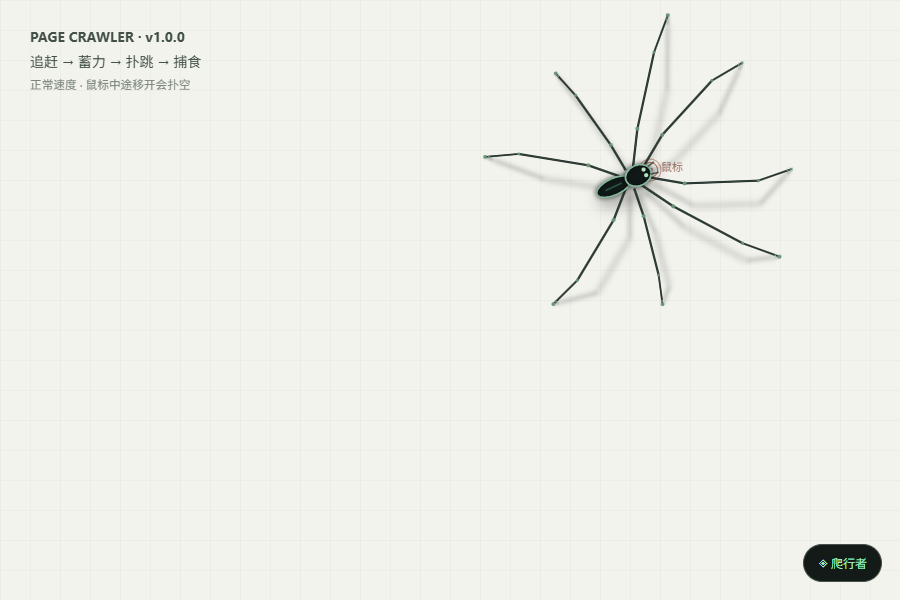
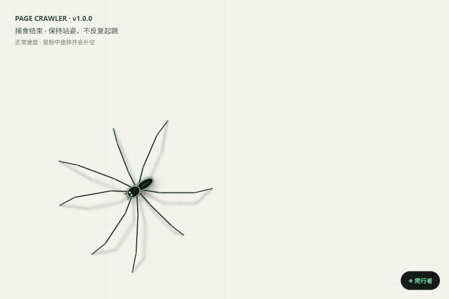
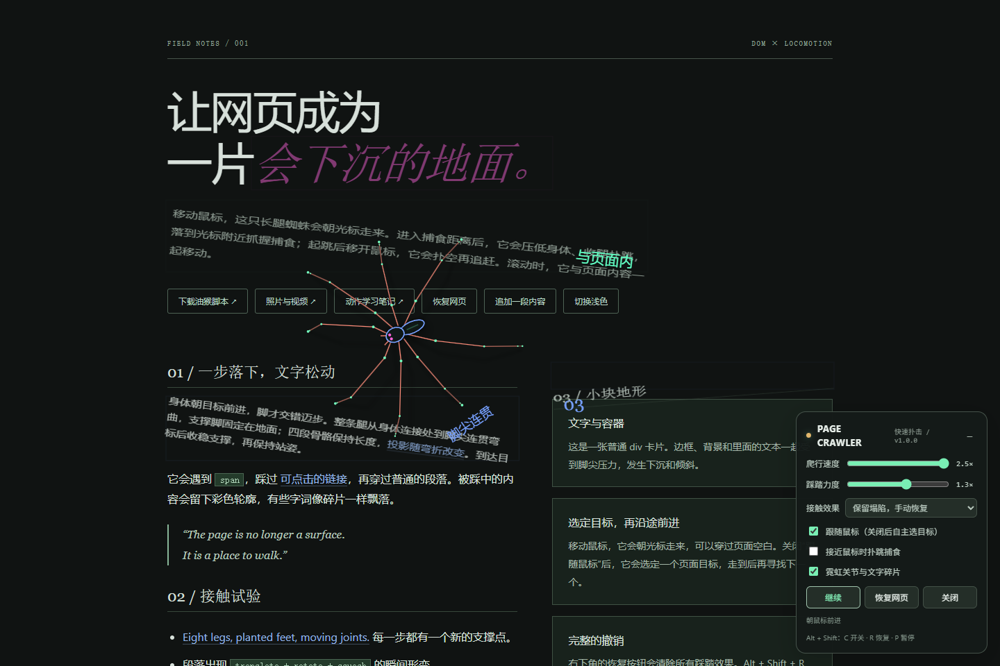
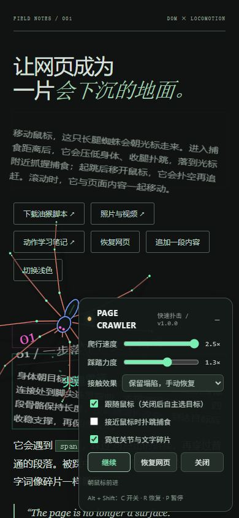
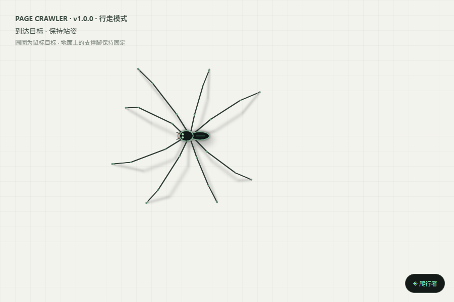

# 演示照片与视频

浏览器入口：[gallery.html](../gallery.html)。全部本项目图片由真实浏览器截图生成，没有使用概念图代替运行效果。

## 快速扑击 · v1.0.0

腾空阶段：脚尖离地，腿向内收，阴影与身体分离。

捕食阶段：前腿抬起抓握，口器开合，其他脚保持支撑。

捕食结束：保持站姿，不因静止光标反复跳跃。

[正常速度捕食 MP4](../assets/videos/hunt.mp4)：包含成功捕食、目标逃开后的扑空，以及再次追赶捕食。浏览器图册可直接播放。

## 页面演示与窄屏

这两张图由页面回归检查生成，关闭捕食以集中展示网页接触、控制面板与布局。

## 行走回放

[正常速度行走 MP4](../assets/videos/walk.mp4)：使用当前 v1.0.0 核心，关闭捕食，展示直行、180° 转身与目标处保持站姿。可通过 `npm run record:walk` 重新录制。

## 文件对应

| 素材 | 文件 |
| --- | --- |
| 快速扑击/捕食/站姿 | `assets/images/preview-hunt-*.png`、`preview-hunt.png` |
| 桌面与窄屏 | `assets/images/preview-desktop.png`、`preview-mobile.png` |
| 行走截图 | `assets/images/preview-motion.png` |
| 正常速度回放 | `assets/videos/hunt.mp4`、`walk.mp4` |
| 外部论文图 | `assets/reference/paper-foot-trajectories.png`，署名见同目录 credits.md |

更新照片与视频的步骤见 [测试与录制](testing.md)。
