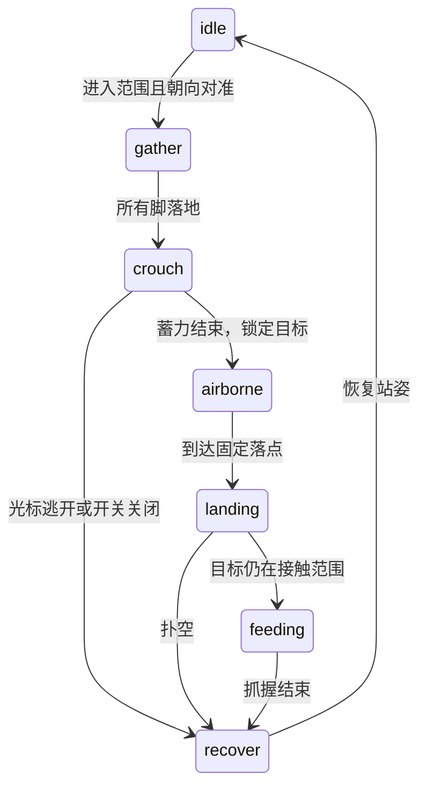

# 学习路线：从画一条腿到稳定扑击

入口代码：[page-crawler.user.js](../page-crawler.user.js)。先运行演示，关闭捕食观察行走，再开启捕食观察起跳。以下公式和参数解释对应当前代码，练习在副本上进行。

## 1. 理解动画时间

阅读 `tick` 和 `synchronize`。每帧用 RAF 时间戳计算 `dt`，单位为秒，而不是每帧固定前进几个像素。这样高刷新率屏幕不会自动提高速度。恢复时重置 `lastTime`，并将时间差限制到 0.04 秒，避免后台返回后突然跃过一大段距离。

练习：在 60 Hz 固定回放中分别把速度设为 0.3、1 和 2.5，比较累计距离。阅读 [MDN 的 requestAnimationFrame 文档](https://developer.mozilla.org/en-US/docs/Web/API/Window/requestAnimationFrame)。

## 2. 把身体坐标转到页面坐标

阅读 `world`、`hipFor` 和 `idealFoot`。身体前方是局部 forward，侧方是 sideways。朝向为 θ 时：

```text
x = body.x + cos(θ) × forward − sin(θ) × sideways
y = body.y + sin(θ) × forward + cos(θ) × sideways
```

不要让脚一直跟着身体坐标变化。期望落点可以随身体改变，已经落地的脚必须保持自己的页面位置，直到真正起步。

练习：暂停演示并滚动。身体与全部脚尖应一起平移，脚相对身体的位置和当前迈步进度不应变化。

## 3. 用三维表示腿，最后才投影

页面为 z=0，z 增大代表朝屏幕外的相机方向移动。每个关节都有 x/y/z，真实骨长由三维点之间的距离决定。

阅读 `project`：相机距离 D=600，投影比例为 D/(D−z)。页面上的脚尖 z=0，因此投影位置恰好仍是 DOM 坐标；高处关节的比例更大。相机以身体 x/y 为中心，便于整体移动和滚动。

练习：在捕食阶段读取 `crawlerStatus().bodyHeight` 和各脚的 `lift`。腾空中间应同时大于零，而不是仅仅放大一张平面图。

## 4. 将整条腿作为弓形链求解

阅读 `solveLeg`。旧实现每帧选择不同的镜像弯折解，容易左右翻转；当前解法只保持一个朝上的弯折平面，所有关节从同一个曲率参数得到。

把四段长度记为 L₀…L₃。末两段沿同一方向，功能上合并为一段；前三个方向依次是 α、α−φ/2、α−φ。未旋转的链末端可写成：

```text
Vx = L₀ + L₁ cos(φ/2) + (L₂+L₃) cos(φ)
Vy = −L₁ sin(φ/2) − (L₂+L₃) sin(φ)
```

在代码允许的弯折范围内，用 24 次二分搜索让 |V| 等于髋到脚尖的距离，再令 α=−atan2(Vy,Vx)。这样整条链的末端对准脚尖，近端自然参加伸缩。

接着把这组二维方向放入由髋—脚轴、朝上方向和小幅外展组成的三维平面。各段逐一累加固定长度，最后投影。这里的解是简化的动画几何，不包含肌肉或液压。

练习：运行 `npm run test:legs`，检查骨长误差和弯折平面的单帧变化。不要用“相对身体位移很大”直接判断翻转，因为正常快速转身也会产生很大的相对位移。

## 5. 让每只脚独立起落

阅读 `updateLegs`。脚要迈步时记住 from 与 target，随后用 **smoothstep(t)=t²(3−2t)** 平滑移动 x/y；抬脚高度用 sin²(πt) 产生起落。

脚是否需要移动，由伸展距离、偏离理想位置和朝向误差决定。没有“无论身体是否移动，每隔一段时间就迈步”的永久循环，因此到达目标后可以真正停下来。

练习：将光标保持不动，捕食结束后观察 steps。它应保持稳定。轻微移动光标也不应重新启动捕食。

## 6. 区分四脚落地与真正有支撑

阅读 `supportMargin`。四只脚落地并不保证身体落在它们中间。当前模型先求落地脚的凸包，再检查身体是否在凸包内，且距离边界有一定余量。

抬脚前排除即将抬起的脚，再求一次支撑区域。身体前进也验证当前区域。腾空阶段没有地面支撑是正常的；检查应按动作阶段区分，不能要求飞行中的蜘蛛仍有四只脚落地。

练习：阅读测试中 supportMargin 的独立计算，比较“计数”和“空间分布”两个条件。

## 7. 用预测落点加快转向

阅读 `chooseFoothold` 和 `tick`。新落点不只按当前朝向计算，还考虑下一段时间的旋转。每一步角位移有限，并保持邻脚绕身体的次序。

身体角速度有加减速；候选角度违反约束时逐步缩小该帧转动，而不是把整次转动完全撤销。目标在正后方时保持前一次转向符号，避免左右来回犹豫。

练习：运行 `npm run test:legs` 查看 halfTurnSeconds，并在演示中将鼠标从身体一侧快速移到另一侧。

## 8. 用状态机组织捕食

阅读 `updateHunt`。捕食依次经过：



蓄力阶段先记录 windup，身体沿朝向反方向后移最多 22 像素、压低 8 像素，髋部和腹部收拢。八只脚仍保持页面坐标，整条腿链重新闭合，因此腿的近端也随身体一起弯曲。提前验证支撑区域与骨长可达范围，受限时减小后移量。蓄力持续 0.18 秒，腾空的前 45% 再迅速展开身体。

在起跳时记录后移后的 origin 与 landing；腾空后不继续修改落点。鼠标突然移开时就会扑空，动作完成后再处理新目标。

当前常速飞行时间 T 约 0.11–0.17 秒，t=经过时间/T。横向位置线性插值，高度使用：

```text
z = 18 − 8(1−t) + 4×34×t(1−t)
```

前一项衔接压低的起跳姿态，抛物线项产生短促跃起。脚向内收再展开，最小伸展限制确保仍能闭合固定长度腿链。落地后六只脚支撑、前腿抓握。冷却之外还要求光标离上次目标超过 65 像素，避免小抖动引发重复攻击。

练习：运行 `npm run test:hunt`，查看 flightSeconds、maximumAirSpeed 和 misses。减少 T 会加快横向速度，但必须仍给腿留下连续的可解姿态。

## 9. 把 DOM 效果当作视觉反馈

阅读 `targetAt`、`impact` 和 `restore`。整张页面都能走，DOM 不承担导航地面职责。脚落地后才检查元素是否允许产生效果。

块级容器使用可撤销的 Web Animations 动画；文字碎片绘制在覆盖层。恢复会取消本脚本动画，不删除文字、不重新组织原页面 DOM。输入、按钮、编辑器、媒体、固定导航和大布局容器跳过形变。

练习：在输入框中输入，再点击链接，最后恢复网页。比较操作前后 DOM 属性与层级；参见 `tests/check.cjs`。

## 10. 用测量收敛视觉问题

先描述可以观察的错误，再选择量：左右翻转用弯折平面角变化；拉伸用三维骨长误差；低效转身用半转耗时；踱步用到达后 steps 增量；慢跳用飞行时间和速度；失去支撑用凸包内外判断。

最后阅读 [测试与录制](testing.md)，用真实脚本录制正常速度视频。自动检查能验证限定场景中的约束，最终姿态与节奏仍需要结合画面判断。
