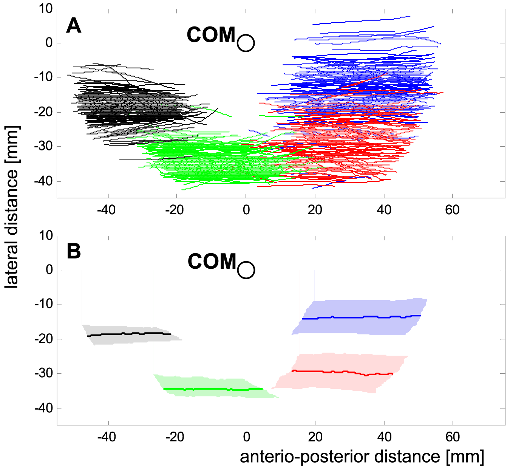

# 论文、参考资料与素材来源

## 用户提供的运动论文

**Tom Weihmann (2013)**. *Crawling at High Speeds: Steady Level Locomotion in the Spider Cupiennius salei—Global Kinematics and Implications for Centre of Mass Dynamics*. PLoS ONE 8(6): e65788.

- [论文全文](https://journals.plos.org/plosone/article?id=10.1371/journal.pone.0065788)
- [DOI](https://doi.org/10.1371/journal.pone.0065788)
- [Figure 1](https://doi.org/10.1371/journal.pone.0065788.g001)
- [本地 Figure 1 图片](../assets/reference/paper-foot-trajectories.png)

采用的结构依据是功能弓形腿，以及前两对、侧方第三对、后方第四对不同的接触分布。研究对象为 **Cupiennius salei 的直线匀速运动**，并非幽灵蛛急转身或捕食扑跳实验。[来源：论文的 Leg characteristics、Figure 1 和 Abstract](https://journals.plos.org/plosone/article?id=10.1371/journal.pone.0065788)。

项目据此选择模型结构，但长度比例、转向速度、跳跃高度、捕食范围和冷却时间均由动画实现与回放调节。直线运动中的小幅 yaw 不应当作急转角度上限；文中无腾空的直线跑动也不等于“蜘蛛不能跳”。当前捕食动作是用户提出的演示功能，未声称复制某个物种的捕食生物力学。

**图片署名：** Figure 1，Tom Weihmann，2013，PLOS ONE，doi:10.1371/journal.pone.0065788.g001。原论文标注 Creative Commons Attribution License，转载保留作者与来源；图像未修改。完整来源说明见 [assets/reference/credits.md](../assets/reference/credits.md)。

## 官方技术资料

| 来源 | 对应学习内容 |
| --- | --- |
| [MDN · requestAnimationFrame](https://developer.mozilla.org/en-US/docs/Web/API/Window/requestAnimationFrame) | 按真实时间差推进动画和处理后台恢复 |
| [MDN · CanvasRenderingContext2D](https://developer.mozilla.org/en-US/docs/Web/API/CanvasRenderingContext2D) | 线段、关节、阴影、变换和深度排序的绘制基础 |
| [MDN · Element.animate](https://developer.mozilla.org/en-US/docs/Web/API/Element/animate) | 可撤销的网页形变动画 |
| [MDN · Element.attachShadow](https://developer.mozilla.org/en-US/docs/Web/API/Element/attachShadow) | 覆盖层面板样式隔离 |
| [MDN · PointerEvent](https://developer.mozilla.org/en-US/docs/Web/API/PointerEvent) | 鼠标目标与触摸输入区分 |
| [Tampermonkey 官方文档](https://www.tampermonkey.net/documentation.php) | 用户脚本元数据、配置与菜单接口 |
| [Playwright · Browsers](https://playwright.dev/docs/browsers) | 测试用 Edge 和 Chromium 的选择与安装 |

## 本项目媒体

演示照片和视频由实际脚本在浏览器中生成，见 [图册](gallery.md)。论文图是外部科学参考图，单独存放并署名，不是项目运行截图。原始用户参考视频没有放入可移植项目包，避免依赖用户电脑上的下载目录。
